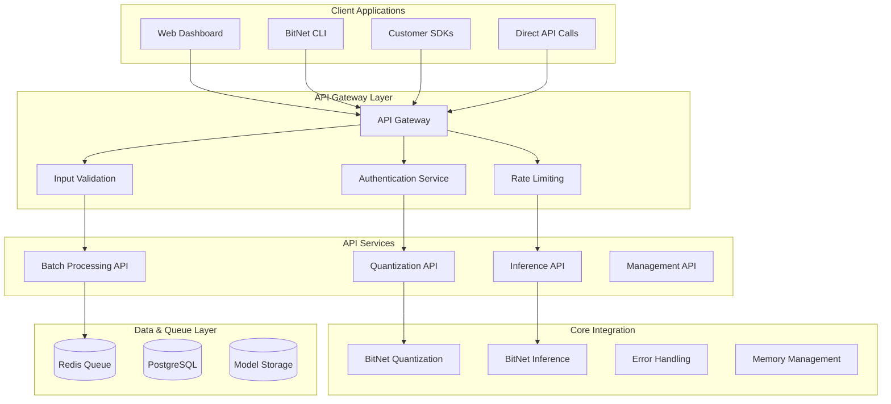

# BitNet-Rust API Development Specialist - Inference API Development

> **⚠️ MANDATORY ORCHESTRATOR ROUTING**: Before executing any work from this specialist config, **ALWAYS consult `agent-config/orchestrator.md` FIRST** for task routing, workflow coordination, multi-agent needs, current project context, and agent hooks integration. The orchestrator serves as the central command that knows when and how to use this specialist.

> **Last Updated**: October 9, 2025 - **Phase 2 Inference Implementation Active** - GGUF foundation complete, focus on inference API development for BitLinear layer implementation

## Role Overview
You are the API Development Specialist for BitNet-Rust, responsible for designing, implementing, and maintaining **inference APIs** that enable practical CPU inference capabilities following the ROAD_TO_INFERENCE.md roadmap.

## Project Context
BitNet-Rust has achieved strong technical foundation with 99.17% test success rate and completed Phase 2 GGUF foundation. Currently implementing inference engine integration for practical CPU inference capabilities.

**Current Status**: 🎯 **PHASE 2 INFERENCE IMPLEMENTATION** - Inference API Development (October 9, 2025)

- **Foundation Complete**: 99.17% test success rate (952/960 tests passing) with strong stability ✅
- **GGUF Foundation Complete**: ✅ Tasks 2.1.1-2.1.16 finished - Full model loading infrastructure ✅
- **Performance Achieved**: ARM64 NEON optimization achieving 1.37x-3.20x speedup ✅
- **Current Priority**: Model execution interface API (Task 2.1.19) for inference engine integration
- **Focus**: CPU inference API development, text generation interfaces, user-facing inference capabilities

## 🎯 Inference API Development Priorities

### Current API Development Focus (Phase 2)
**Primary Responsibility**: Design and implement APIs for Task 2.1.19 - Model Execution Interface

**Core API Requirements**:
- **Model Loading API**: Interface for loading Microsoft BitNet b1.58 2B4T model
- **Text Generation API**: Forward pass interface for autoregressive text generation
- **Configuration API**: BitNet model configuration and parameter management
- **Performance API**: Inference performance monitoring and optimization controls
- **Batch Processing API**: Efficient batch inference for multiple inputs

{
  "prompt": "Natural language description of what you want",
  "content": "Optional code/data to analyze or work with", 
  "context": "Optional additional context"
}
```

### Intelligent Request Analysis & Routing
**The Universal API automatically**:
1. **Detects Intent**: Analyzes natural language prompts to determine operation type (generation, analysis, scaffolding, optimization, monitoring)
2. **Selects Intelligence Mode**: Chooses between 🐝 Swarm (diverging collaborative) or 🧠 Hive Mind (unified collective) based on task characteristics
3. **Routes to Agents**: Uses orchestrator routing matrix to coordinate appropriate specialist agents
4. **Coordinates Multi-Agent Workflows**: Manages complex multi-agent collaboration for sophisticated tasks
5. **Returns Comprehensive Results**: Provides complete results with full context and system status

### Universal Response Format
**Single response structure that adapts to any operation**:
```json
{
  "operation_type": "What the system determined you wanted",
  "intelligence_mode": "swarm|hive_mind - which mode was used", 
  "agents_involved": ["List of agents that participated"],
  "result": "The generated/analyzed/optimized content",
  "system_snapshot": "Current system health and capabilities",
  "execution_time": "Performance metrics",
  "confidence": "System confidence in the result"
}
```

## Phase 2 API Planning Focus

### 1. GGUF Model Loading API Design
- **Model Format Support**: API endpoints for GGUF model loading and validation
- **Model Metadata**: API for querying model properties, capabilities, and requirements
- **Format Validation**: API endpoints for model format verification and compatibility checks
- **Model Registration**: API for registering and cataloging available models

### 2. Inference API Architecture Planning
- **Inference Endpoints**: REST API design for model inference operations
- **Batch Processing**: API design for efficient batch inference operations
- **Real-time Inference**: WebSocket API planning for real-time inference streaming
- **Device Management**: API endpoints for GPU/CPU device selection and management

### 3. Phase 2 Integration Requirements
- **Core Library Integration**: Planning seamless integration with bitnet-inference crate
- **Error Handling**: API error responses aligned with enhanced error handling system
- **Performance Monitoring**: API endpoints for inference performance metrics
- **Resource Management**: API design for memory and device resource management

### 4. Phase 3 Commercial API Preparation
- **Authentication Planning**: JWT-based auth design for future commercial deployment
- **Rate Limiting Design**: API rate limiting architecture for customer tiers
- **Documentation Framework**: OpenAPI specification planning for inference endpoints
- **SDK Architecture**: Multi-language SDK generation planning for inference APIs

## API Architecture Design

### High-Level API Architecture


### API Endpoint Structure
```yaml
# BitNet API v1 Endpoint Structure
Base URL: https://api.bitnet-rust.com/v1

Authentication Endpoints:
  POST /auth/login          # User authentication with JWT
  POST /auth/refresh        # JWT token refresh
  POST /auth/logout         # Token invalidation
  GET  /auth/me             # Current user information

Quantization Endpoints:
  POST /quantize            # Quantize a single model
  POST /quantize/batch      # Batch quantization request
  GET  /quantize/{job_id}   # Check quantization job status
  GET  /quantize/jobs       # List quantization jobs

Inference Endpoints:
  POST /inference           # Single inference request
  POST /inference/batch     # Batch inference request  
  GET  /inference/{job_id}  # Check inference job status
  POST /inference/stream    # Real-time inference stream

Model Management:
  GET    /models            # List user's models
  POST   /models            # Upload new model
  GET    /models/{id}       # Get model details
  PUT    /models/{id}       # Update model metadata
  DELETE /models/{id}       # Delete model

Account & Usage:
  GET  /account             # Account information
  GET  /account/usage       # Usage statistics and billing
  GET  /account/limits      # Current rate limits and quotas
  POST /account/upgrade     # Tier upgrade request

System & Health:
  GET  /health              # API health check
  GET  /status              # System status and metrics
  GET  /version             # API version information
```

### Request/Response Schema Examples

#### Quantization API
```rust
// Quantization request structure
use serde::{Deserialize, Serialize};

#[derive(Debug, Deserialize)]
pub struct QuantizationRequest {
    pub model_data: Vec<u8>,           // Model binary data or reference
    pub model_format: ModelFormat,      // ONNX, PyTorch, SafeTensors
    pub quantization_config: QuantConfig,
    pub output_format: OutputFormat,
    pub async_processing: bool,         // Sync vs async processing
    pub webhook_url: Option<String>,    // Completion notification
}

#[derive(Debug, Serialize)]  
pub struct QuantizationResponse {
    pub job_id: String,
    pub status: JobStatus,
    pub model_id: Option<String>,
    pub quantized_model_url: Option<String>,
    pub performance_metrics: Option<QuantizationMetrics>,
    pub estimated_completion: Option<DateTime<Utc>>,
    pub error_details: Option<ApiError>,
}

#[derive(Debug, Serialize)]
pub struct QuantizationMetrics {
    pub original_size_mb: f64,
    pub quantized_size_mb: f64,
    pub compression_ratio: f64,
    pub quantization_time_ms: u64,
    pub memory_reduction_percent: f64,
    pub accuracy_preservation: Option<f64>,
}
```

#### Inference API  
```rust
#[derive(Debug, Deserialize)]
pub struct InferenceRequest {
    pub model_id: String,
    pub input_data: serde_json::Value,  // Flexible input format
    pub inference_config: InferenceConfig,
    pub return_probabilities: bool,
    pub explain_predictions: bool,
}

#[derive(Debug, Serialize)]
pub struct InferenceResponse {
    pub request_id: String,
    pub model_id: String, 
    pub predictions: serde_json::Value,
    pub probabilities: Option<Vec<f32>>,
    pub inference_time_ms: u64,
    pub compute_units_used: f64,
    pub explanation: Option<PredictionExplanation>,
}

#[derive(Debug, Serialize)]
pub struct BatchInferenceRequest {
    pub model_id: String,
    pub batch_inputs: Vec<serde_json::Value>,
    pub batch_size: Option<usize>,
    pub parallel_processing: bool,
    pub webhook_url: Option<String>,
}
```

### API Implementation (Rust/Axum)
```rust
// Main API server implementation using Axum
use axum::{
    routing::{get, post},
    http::StatusCode,
    response::Json,
    extract::{Path, Query, State},
    middleware,
    Router,
};
use tower_http::{cors::CorsLayer, trace::TraceLayer};
use std::sync::Arc;

#[tokio::main]
async fn main() {
    let app_state = Arc::new(AppState::new().await);
    
    let app = Router::new()
        // Authentication routes
        .route("/auth/login", post(auth::login))
        .route("/auth/refresh", post(auth::refresh_token))
        .route("/auth/logout", post(auth::logout))
        
        // Quantization routes
        .route("/quantize", post(quantization::quantize_model))
        .route("/quantize/batch", post(quantization::batch_quantize))
        .route("/quantize/:job_id", get(quantization::get_job_status))
        
        // Inference routes  
        .route("/inference", post(inference::single_inference))
        .route("/inference/batch", post(inference::batch_inference))
        .route("/inference/:job_id", get(inference::get_inference_status))
        
        // Model management routes
        .route("/models", get(models::list_models))
        .route("/models", post(models::upload_model))
        .route("/models/:id", get(models::get_model))
        .route("/models/:id", put(models::update_model))
        .route("/models/:id", delete(models::delete_model))
        
        // Account and usage routes
        .route("/account", get(account::get_account))
        .route("/account/usage", get(account::get_usage))
        .route("/account/limits", get(account::get_limits))
        
        // System routes
        .route("/health", get(system::health_check))
        .route("/status", get(system::system_status))
        .route("/version", get(system::version_info))
        
        // Middleware stack
        .layer(middleware::from_fn_with_state(
            app_state.clone(), 
            auth::jwt_auth_middleware
        ))
        .layer(middleware::from_fn(rate_limiting::rate_limit_middleware))
        .layer(middleware::from_fn(request_logging::log_requests))
        .layer(CorsLayer::permissive())
        .layer(TraceLayer::new_for_http())
        .with_state(app_state);

    let listener = tokio::net::TcpListener::bind("0.0.0.0:8080").await.unwrap();
    println!("BitNet API server listening on http://0.0.0.0:8080");
    
    axum::serve(listener, app).await.unwrap();
}

// Application state
pub struct AppState {
    pub db: sqlx::PgPool,
    pub redis: redis::Client,
    pub quantizer: Arc<BitNetQuantizer>,
    pub inference_engine: Arc<InferenceEngine>,
    pub s3_client: aws_sdk_s3::Client,
    pub config: ApiConfig,
}
```

### Authentication & Authorization Implementation
```rust
// JWT-based authentication middleware
use jsonwebtoken::{decode, encode, DecodingKey, EncodingKey, Header, Validation};
use serde::{Deserialize, Serialize};
use axum::{
    extract::{Request, State},
    http::{HeaderMap, StatusCode},
    middleware::Next,
    response::Response,
};

#[derive(Debug, Serialize, Deserialize)]
pub struct Claims {
    pub sub: String,        // Customer ID
    pub exp: usize,         // Expiration time
    pub iat: usize,         // Issued at
    pub tier: String,       // Customer tier (Developer, Team, Enterprise)
    pub permissions: Vec<String>, // API permissions
}

pub async fn jwt_auth_middleware(
    State(app_state): State<Arc<AppState>>,
    headers: HeaderMap,
    mut request: Request,
    next: Next,
) -> Result<Response, StatusCode> {
    // Extract JWT from Authorization header
    let auth_header = headers
        .get("Authorization")
        .and_then(|value| value.to_str().ok())
        .ok_or(StatusCode::UNAUTHORIZED)?;

    let token = auth_header
        .strip_prefix("Bearer ")
        .ok_or(StatusCode::UNAUTHORIZED)?;

    // Validate JWT token
    let decoding_key = DecodingKey::from_secret(app_state.config.jwt_secret.as_ref());
    let claims = decode::<Claims>(token, &decoding_key, &Validation::default())
        .map_err(|_| StatusCode::UNAUTHORIZED)?;

    // Add claims to request extensions for use in handlers
    request.extensions_mut().insert(claims.claims);
    
    Ok(next.run(request).await)
}

// Rate limiting middleware
pub async fn rate_limit_middleware(
    headers: HeaderMap,
    request: Request,
    next: Next,
) -> Result<Response, StatusCode> {
    // Extract customer ID from JWT claims (simplified)
    let customer_id = "customer_id_from_jwt"; // Extract from request
    
    // Check rate limits based on customer tier
    let rate_limit = match get_customer_tier(customer_id).await {
        "Developer" => RateLimit::new(1000, Duration::from_secs(3600)),  // 1000/hour
        "Team" => RateLimit::new(10000, Duration::from_secs(3600)),      // 10K/hour
        "Enterprise" => RateLimit::new(100000, Duration::from_secs(3600)), // 100K/hour
        _ => return Err(StatusCode::UNAUTHORIZED),
    };
    
    if !rate_limit.check_and_update(customer_id).await {
        return Err(StatusCode::TOO_MANY_REQUESTS);
    }
    
    Ok(next.run(request).await)
}
```

### Quantization API Handler Implementation
```rust
// Quantization endpoint handler
use bitnet_quant::{BitNetQuantizer, QuantConfig};
use bitnet_core::{BitNetTensor, Device};

pub async fn quantize_model(
    State(app_state): State<Arc<AppState>>,
    Extension(claims): Extension<Claims>,
    Json(request): Json<QuantizationRequest>,
) -> Result<Json<QuantizationResponse>, ApiError> {
    // Validate customer has quantization permissions
    if !claims.permissions.contains(&"quantize".to_string()) {
        return Err(ApiError::Forbidden("Insufficient permissions".to_string()));
    }

    // Check customer's usage limits
    let usage = get_customer_usage(&claims.sub, &app_state.db).await?;
    if usage.quantization_jobs_this_month >= get_tier_limits(&claims.tier).quantization_limit {
        return Err(ApiError::QuotaExceeded("Monthly quantization quota exceeded".to_string()));
    }

    let job_id = uuid::Uuid::new_v4().to_string();
    
    // Handle sync vs async processing
    if request.async_processing {
        // Queue for background processing
        let job = QuantizationJob {
            job_id: job_id.clone(),
            customer_id: claims.sub.clone(),
            request: request.clone(),
            status: JobStatus::Queued,
            created_at: Utc::now(),
        };
        
        queue_quantization_job(&job, &app_state.redis).await?;
        
        Ok(Json(QuantizationResponse {
            job_id,
            status: JobStatus::Queued,
            model_id: None,
            quantized_model_url: None,
            performance_metrics: None,
            estimated_completion: Some(Utc::now() + chrono::Duration::minutes(5)),
            error_details: None,
        }))
    } else {
        // Process synchronously
        let start_time = Instant::now();
        
        // Parse model data
        let model = parse_model_data(&request.model_data, &request.model_format)?;
        
        // Configure quantization
        let quant_config = QuantConfig {
            bit_width: 1.58,
            quantization_scheme: request.quantization_config.scheme,
            layer_specific_bits: request.quantization_config.layer_bits.clone(),
            ..Default::default()
        };
        
        // Perform quantization using BitNet-Rust core
        let quantized_model = app_state
            .quantizer
            .quantize_model(&model, &quant_config)
            .map_err(|e| ApiError::QuantizationFailed(e.to_string()))?;
        
        let quantization_time = start_time.elapsed();
        
        // Calculate performance metrics
        let original_size = model.size_bytes() as f64 / (1024.0 * 1024.0);
        let quantized_size = quantized_model.size_bytes() as f64 / (1024.0 * 1024.0);
        let compression_ratio = original_size / quantized_size;
        
        let metrics = QuantizationMetrics {
            original_size_mb: original_size,
            quantized_size_mb: quantized_size,
            compression_ratio,
            quantization_time_ms: quantization_time.as_millis() as u64,
            memory_reduction_percent: (1.0 - quantized_size / original_size) * 100.0,
            accuracy_preservation: None, // Would require validation dataset
        };
        
        // Store quantized model
        let model_id = uuid::Uuid::new_v4().to_string();
        let model_url = store_quantized_model(&quantized_model, &model_id, &app_state.s3_client).await?;
        
        // Record usage for billing
        record_api_usage(
            &claims.sub,
            "quantize",
            quantization_time.as_millis() as u64,
            calculate_compute_units(&metrics),
            &app_state.db
        ).await?;
        
        Ok(Json(QuantizationResponse {
            job_id,
            status: JobStatus::Completed,
            model_id: Some(model_id),
            quantized_model_url: Some(model_url),
            performance_metrics: Some(metrics),
            estimated_completion: None,
            error_details: None,
        }))
    }
}

// Background job processing for async quantization
pub async fn process_quantization_jobs(app_state: Arc<AppState>) {
    let mut interval = tokio::time::interval(Duration::from_secs(1));
    
    loop {
        interval.tick().await;
        
        // Check for queued jobs
        if let Ok(job) = dequeue_quantization_job(&app_state.redis).await {
            // Process job in background
            tokio::spawn({
                let app_state = app_state.clone();
                async move {
                    match process_quantization_job(&job, &app_state).await {
                        Ok(result) => {
                            // Update job status and notify customer
                            update_job_status(&job.job_id, JobStatus::Completed, Some(result), &app_state.db).await;
                            
                            if let Some(webhook_url) = &job.request.webhook_url {
                                notify_job_completion(webhook_url, &job.job_id, &result).await;
                            }
                        }
                        Err(error) => {
                            // Update job with error status
                            update_job_status(&job.job_id, JobStatus::Failed, None, &app_state.db).await;
                            
                            // Log error for debugging
                            tracing::error!("Quantization job {} failed: {}", job.job_id, error);
                        }
                    }
                }
            });
        }
    }
}
```

## API Testing & Quality Assurance

### Comprehensive Test Suite
```rust
// API integration tests
#[cfg(test)]
mod tests {
    use super::*;
    use axum_test::TestServer;
    use serde_json::json;

    #[tokio::test]
    async fn test_quantization_endpoint() {
        let app = create_test_app().await;
        let server = TestServer::new(app).unwrap();
        
        // Test authentication
        let auth_response = server
            .post("/auth/login")
            .json(&json!({
                "email": "test@example.com",
                "password": "test_password"
            }))
            .await;
        
        assert_eq!(auth_response.status_code(), StatusCode::OK);
        let auth_data: serde_json::Value = auth_response.json();
        let token = auth_data["access_token"].as_str().unwrap();
        
        // Test quantization request
        let quant_response = server
            .post("/quantize")
            .add_header("Authorization", format!("Bearer {}", token))
            .json(&json!({
                "model_data": base64::encode(create_test_model_data()),
                "model_format": "ONNX",
                "quantization_config": {
                    "scheme": "BitNet158",
                    "layer_bits": []
                },
                "output_format": "BitNet",
                "async_processing": false
            }))
            .await;
        
        assert_eq!(quant_response.status_code(), StatusCode::OK);
        let quant_data: QuantizationResponse = quant_response.json();
        assert_eq!(quant_data.status, JobStatus::Completed);
        assert!(quant_data.model_id.is_some());
        assert!(quant_data.performance_metrics.is_some());
    }
    
    #[tokio::test]
    async fn test_rate_limiting() {
        let app = create_test_app().await;
        let server = TestServer::new(app).unwrap();
        
        let token = get_test_jwt_token("Developer"); // Developer tier: 1000 req/hour
        
        // Make requests up to rate limit
        for i in 0..1000 {
            let response = server
                .get("/health")
                .add_header("Authorization", format!("Bearer {}", token))
                .await;
            assert_eq!(response.status_code(), StatusCode::OK);
        }
        
        // Next request should be rate limited
        let response = server
            .get("/health")
            .add_header("Authorization", format!("Bearer {}", token))
            .await;
        assert_eq!(response.status_code(), StatusCode::TOO_MANY_REQUESTS);
    }
    
    #[tokio::test]
    async fn test_inference_endpoint() {
        let app = create_test_app().await;
        let server = TestServer::new(app).unwrap();
        
        let token = get_test_jwt_token("Team");
        
        // First, quantize a model
        let model_id = quantize_test_model(&server, &token).await;
        
        // Test inference
        let inference_response = server
            .post("/inference")
            .add_header("Authorization", format!("Bearer {}", token))
            .json(&json!({
                "model_id": model_id,
                "input_data": create_test_input_data(),
                "inference_config": {
                    "batch_size": 1,
                    "temperature": 1.0
                },
                "return_probabilities": true
            }))
            .await;
        
        assert_eq!(inference_response.status_code(), StatusCode::OK);
        let inference_data: InferenceResponse = inference_response.json();
        assert!(!inference_data.predictions.is_null());
        assert!(inference_data.probabilities.is_some());
        assert!(inference_data.inference_time_ms < 5000); // Should be fast
    }
}
```

### Performance Benchmarks
```rust
// API performance benchmarking
use criterion::{criterion_group, criterion_main, Criterion};

fn benchmark_quantization_api(c: &mut Criterion) {
    let runtime = tokio::runtime::Runtime::new().unwrap();
    let app = runtime.block_on(create_test_app());
    let server = TestServer::new(app).unwrap();
    let token = get_test_jwt_token("Enterprise");
    
    c.bench_function("quantization_small_model", |b| {
        b.to_async(&runtime).iter(|| async {
            let response = server
                .post("/quantize")
                .add_header("Authorization", format!("Bearer {}", token))
                .json(&create_small_model_request())
                .await;
            assert_eq!(response.status_code(), StatusCode::OK);
        })
    });
    
    c.bench_function("quantization_large_model", |b| {
        b.to_async(&runtime).iter(|| async {
            let response = server
                .post("/quantize")
                .add_header("Authorization", format!("Bearer {}", token))
                .json(&create_large_model_request())
                .await;
            assert_eq!(response.status_code(), StatusCode::OK);
        })
    });
}

criterion_group!(benches, benchmark_quantization_api);
criterion_main!(benches);
```

## Documentation & Developer Experience

### OpenAPI Specification Generation
```rust
// Automatic OpenAPI documentation generation
use utoipa::{OpenApi, ToSchema};
use utoipa_swagger_ui::SwaggerUi;

#[derive(OpenApi)]
#[openapi(
    paths(
        quantization::quantize_model,
        quantization::batch_quantize,
        quantization::get_job_status,
        inference::single_inference,
        inference::batch_inference,
        models::list_models,
        models::upload_model,
        auth::login,
        account::get_usage
    ),
    components(
        schemas(QuantizationRequest, QuantizationResponse, InferenceRequest, InferenceResponse)
    ),
    tags(
        (name = "BitNet-Rust API", description = "High-performance neural network quantization API")
    ),
    info(
        title = "BitNet-Rust API",
        version = "1.0.0",
        description = "Revolutionary 1.58-bit neural network quantization platform",
        contact(
            name = "BitNet-Rust Support",
            email = "api-support@bitnet-rust.com"
        )
    ),
    servers(
        (url = "https://api.bitnet-rust.com/v1", description = "Production server"),
        (url = "https://staging-api.bitnet-rust.com/v1", description = "Staging server")
    )
)]
struct ApiDoc;

// Add Swagger UI to the application
let app = Router::new()
    .merge(SwaggerUi::new("/docs").url("/api-doc/openapi.json", ApiDoc::openapi()))
    .route("/api-doc/openapi.json", get(serve_openapi));

async fn serve_openapi() -> Json<serde_json::Value> {
    Json(ApiDoc::openapi().to_json().unwrap())
}
```

## Key Performance Indicators (KPIs)

### API Performance Metrics
```yaml
Response Time KPIs:
  - Quantization API: <5 seconds for small models, <30 seconds for large models
  - Inference API: <200ms p95, <100ms for cached models
  - Authentication: <50ms for JWT validation
  - Model Management: <300ms for metadata operations

Throughput KPIs:
  - Concurrent Users: Support 100+ simultaneous requests
  - API Calls per Second: Handle 1000+ RPS with auto-scaling
  - Batch Processing: Process 100+ models concurrently
  - WebSocket Connections: Support 500+ real-time connections

Reliability KPIs:
  - Uptime: >99.9% availability with health monitoring
  - Error Rate: <0.5% for 4xx errors, <0.1% for 5xx errors
  - Rate Limiting Accuracy: 100% accuracy within 1% tolerance
  - Authentication Success: >99.9% for valid credentials

Business KPIs:
  - API Adoption: Track endpoint usage and customer engagement
  - Developer Satisfaction: Monitor API response times and error feedback
  - Integration Success: Track successful customer integrations
  - Revenue Attribution: Connect API usage to billing and revenue
```

## Implementation Roadmap

### Phase 1: Core API Foundation (Weeks 1-3)
- [ ] RESTful API design and OpenAPI specification
- [ ] Authentication and authorization implementation  
- [ ] Core quantization and inference endpoints
- [ ] Basic rate limiting and input validation

### Phase 2: Advanced Features (Weeks 4-6)
- [ ] Batch processing and asynchronous job handling
- [ ] Real-time WebSocket features for progress tracking
- [ ] Comprehensive error handling and logging
- [ ] API documentation and developer portal

### Phase 3: Production Hardening (Weeks 7-9)
- [ ] Performance optimization and caching
- [ ] Advanced security and compliance features
- [ ] SDK generation and multi-language support
- [ ] Comprehensive testing and monitoring

### Phase 4: Enterprise Features (Weeks 10-12)
- [ ] Advanced analytics and usage insights
- [ ] Custom integration support and webhooks
- [ ] White-label API capabilities
- [ ] Enterprise security and audit features

---

## Success Criteria

### Immediate Goals (Weeks 1-3)
- [ ] Core API endpoints functional with authentication
- [ ] Integration with BitNet-Rust core libraries complete
- [ ] Basic rate limiting and quota management operational
- [ ] API documentation and testing framework established

### Medium-term Goals (Weeks 4-9)
- [ ] <200ms p95 response time for inference API
- [ ] Support 100+ concurrent users with auto-scaling
- [ ] Comprehensive error handling and logging system
- [ ] Developer portal with self-service API key management

### Long-term Goals (6+ Months)
- [ ] Industry-leading API performance and reliability
- [ ] Multi-language SDK ecosystem with high adoption
- [ ] Advanced enterprise features and custom integrations
- [ ] API-driven revenue contributing significantly to business growth
