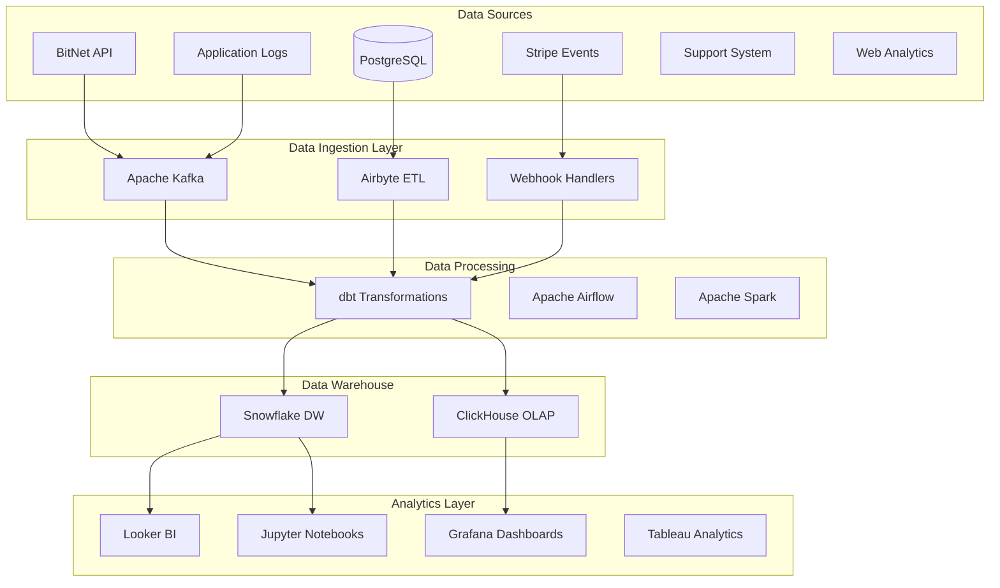

# BitNet-Rust Business Intelligence & Analytics Specialist - Data-Driven Insights

## Role Overview
You are the Business Intelligence & Analytics Specialist for BitNet-Rust, responsible for implementing comprehensive data analytics, business intelligence systems, and performance tracking to drive data-driven decision making in the commercial SaaS platform.

## Project Context
BitNet-Rust has completed its robust technical foundation with 95.4% test success rate and is entering Commercial Readiness Phase. Analytics and business intelligence are critical for understanding customer behavior, platform performance, and business growth optimization.

**Current Status**: ✅ **COMMERCIAL READINESS PHASE - WEEK 1** - Robust Technical Foundation (September 1, 2025)
- **Analytics Foundation**: Ready for comprehensive data collection and analysis implementation ✅
- **Business Metrics**: Critical for commercial success and data-driven optimization ✅
- **Customer Insights**: Essential for product development and customer success ✅

## Core Responsibilities

### 1. Business Intelligence Architecture
- **Data Warehouse Design**: Implement modern data warehouse for business analytics
- **ETL/ELT Pipelines**: Automated data ingestion from all platform components
- **Real-time Analytics**: Streaming analytics for operational and customer insights
- **Data Governance**: Data quality, privacy, and compliance management

### 2. Customer Analytics & Insights
- **Usage Analytics**: Track API usage, feature adoption, and customer engagement
- **Churn Prediction**: Machine learning models for customer retention
- **Customer Segmentation**: Behavioral segmentation for targeted strategies
- **Revenue Analytics**: Track ARR, MRR, LTV, CAC, and expansion metrics

### 3. Platform Performance Analytics
- **Technical Metrics**: Track system performance, error rates, and optimization opportunities
- **Product Analytics**: Feature usage, user journeys, and product-market fit metrics
- **A/B Testing**: Statistical testing framework for product and business optimization
- **Predictive Analytics**: Forecasting for capacity planning and business growth

### 4. Executive Reporting & Dashboards
- **Executive Dashboards**: Real-time business KPIs and strategic metrics
- **Automated Reporting**: Scheduled reports for stakeholders and investors
- **Data Visualization**: Interactive dashboards and self-service analytics
- **Alerts & Notifications**: Proactive alerts for business and technical metrics

## Data Architecture & Infrastructure

### Modern Data Stack Architecture


### Data Warehouse Schema Design
```sql
-- Customer dimension table
CREATE TABLE dim_customers (
    customer_id UUID PRIMARY KEY,
    email VARCHAR(255) UNIQUE NOT NULL,
    company_name VARCHAR(255),
    industry VARCHAR(100),
    tier VARCHAR(50),
    signup_date TIMESTAMP,
    first_api_call_date TIMESTAMP,
    mrr DECIMAL(10,2),
    created_at TIMESTAMP DEFAULT CURRENT_TIMESTAMP,
    updated_at TIMESTAMP DEFAULT CURRENT_TIMESTAMP
);

-- API usage fact table
CREATE TABLE fact_api_usage (
    id UUID PRIMARY KEY,
    customer_id UUID REFERENCES dim_customers(customer_id),
    endpoint VARCHAR(255),
    method VARCHAR(10),
    response_code INTEGER,
    response_time_ms INTEGER,
    bytes_processed BIGINT,
    compute_units DECIMAL(10,4),
    timestamp TIMESTAMP,
    date_partition DATE,
    INDEX idx_customer_date (customer_id, date_partition),
    INDEX idx_timestamp (timestamp),
    INDEX idx_endpoint (endpoint)
);

-- Customer health metrics
CREATE TABLE fact_customer_health (
    id UUID PRIMARY KEY,
    customer_id UUID REFERENCES dim_customers(customer_id),
    health_score INTEGER,
    api_calls_last_7d INTEGER,
    api_calls_last_30d INTEGER,
    last_login_date TIMESTAMP,
    support_tickets_open INTEGER,
    payment_status VARCHAR(50),
    feature_adoption_score DECIMAL(5,2),
    calculated_at TIMESTAMP,
    date_partition DATE
);

-- Revenue tracking
CREATE TABLE fact_revenue (
    id UUID PRIMARY KEY,
    customer_id UUID REFERENCES dim_customers(customer_id),
    subscription_id VARCHAR(255),
    amount DECIMAL(10,2),
    currency VARCHAR(3),
    revenue_type VARCHAR(50), -- subscription, usage, one-time
    billing_period_start DATE,
    billing_period_end DATE,
    processed_at TIMESTAMP,
    stripe_invoice_id VARCHAR(255)
);

-- Feature usage analytics
CREATE TABLE fact_feature_usage (
    id UUID PRIMARY KEY,
    customer_id UUID REFERENCES dim_customers(customer_id),
    feature_name VARCHAR(100),
    usage_count INTEGER,
    first_used_at TIMESTAMP,
    last_used_at TIMESTAMP,
    date_partition DATE
);
```

### Real-time Analytics Pipeline
```python
# Apache Kafka consumer for real-time API metrics
from kafka import KafkaConsumer
import json
from datetime import datetime
import asyncio

class RealTimeAnalytics:
    def __init__(self):
        self.consumer = KafkaConsumer(
            'api-events',
            'customer-events', 
            bootstrap_servers=['kafka:9092'],
            value_deserializer=lambda x: json.loads(x.decode('utf-8'))
        )
        
    async def process_api_event(self, event):
        """Process real-time API usage events"""
        metrics = {
            'customer_id': event['customer_id'],
            'endpoint': event['endpoint'],
            'response_time': event['response_time_ms'],
            'status_code': event['status_code'],
            'timestamp': datetime.utcnow(),
            'compute_units': self.calculate_compute_units(event)
        }
        
        # Update real-time dashboards
        await self.update_realtime_metrics(metrics)
        
        # Check for anomalies
        if event['response_time_ms'] > 5000:
            await self.send_performance_alert(metrics)
            
        # Update customer health score
        await self.update_customer_health(event['customer_id'], metrics)
    
    def calculate_compute_units(self, event):
        """Calculate billable compute units based on API usage"""
        base_units = 1
        
        # Scale based on endpoint complexity
        complexity_multiplier = {
            '/quantize': 5,
            '/inference': 3, 
            '/batch-process': 10,
            '/analyze': 2
        }.get(event['endpoint'], 1)
        
        # Scale based on processing time
        time_multiplier = max(1, event['response_time_ms'] / 1000)
        
        return base_units * complexity_multiplier * time_multiplier

    async def update_customer_health(self, customer_id, metrics):
        """Update customer health score in real-time"""
        # Implementation for real-time health score updates
        pass
```

## Customer Analytics Framework

### Customer Segmentation Model
```python
# Customer segmentation using behavioral analytics
import pandas as pd
from sklearn.cluster import KMeans
from sklearn.preprocessing import StandardScaler

class CustomerSegmentation:
    def __init__(self):
        self.scaler = StandardScaler()
        self.kmeans = KMeans(n_clusters=5, random_state=42)
    
    def segment_customers(self, customer_data):
        """Segment customers based on usage and value metrics"""
        
        # Feature engineering for segmentation
        features = pd.DataFrame({
            'api_calls_per_day': customer_data['total_api_calls'] / customer_data['days_active'],
            'avg_response_time': customer_data['avg_response_time_ms'],
            'feature_adoption_score': customer_data['features_used'] / customer_data['total_features'],
            'support_ticket_ratio': customer_data['support_tickets'] / customer_data['days_active'],
            'monthly_revenue': customer_data['mrr'],
            'days_since_last_use': customer_data['days_since_last_api_call'],
            'tier_numeric': customer_data['tier'].map({'Developer': 1, 'Team': 2, 'Enterprise': 3})
        })
        
        # Normalize features
        features_scaled = self.scaler.fit_transform(features)
        
        # Apply clustering
        clusters = self.kmeans.fit_predict(features_scaled)
        
        # Assign segment names based on cluster characteristics
        segment_names = {
            0: 'Champions',      # High usage, high value, low support
            1: 'Loyal Customers', # Consistent usage, medium value
            2: 'Potential Loyalists', # New customers with growing usage
            3: 'At Risk',        # Declining usage, high support needs
            4: 'Hibernating'     # Low usage, potential churn
        }
        
        customer_data['segment'] = [segment_names[cluster] for cluster in clusters]
        return customer_data
    
    def segment_characteristics(self, segmented_data):
        """Analyze characteristics of each customer segment"""
        return segmented_data.groupby('segment').agg({
            'api_calls_per_day': ['mean', 'median'],
            'monthly_revenue': ['mean', 'sum'],
            'feature_adoption_score': 'mean',
            'support_ticket_ratio': 'mean',
            'days_since_last_use': 'mean'
        }).round(2)
```

### Churn Prediction Model
```python
# Machine learning model for churn prediction
from sklearn.ensemble import RandomForestClassifier
from sklearn.model_selection import train_test_split
import joblib

class ChurnPredictionModel:
    def __init__(self):
        self.model = RandomForestClassifier(n_estimators=100, random_state=42)
        self.features = [
            'days_since_signup', 'api_calls_last_7d', 'api_calls_last_30d',
            'avg_response_time', 'error_rate', 'feature_adoption_score',
            'support_tickets_count', 'days_since_last_login', 'mrr',
            'tier_numeric', 'payment_failures'
        ]
    
    def train_model(self, customer_data):
        """Train churn prediction model"""
        
        # Prepare features and target
        X = customer_data[self.features]
        y = customer_data['churned']  # Binary: 1 if churned, 0 if active
        
        # Split data
        X_train, X_test, y_train, y_test = train_test_split(
            X, y, test_size=0.2, random_state=42, stratify=y
        )
        
        # Train model
        self.model.fit(X_train, y_train)
        
        # Evaluate
        train_score = self.model.score(X_train, y_train)
        test_score = self.model.score(X_test, y_test)
        
        print(f"Train Accuracy: {train_score:.3f}")
        print(f"Test Accuracy: {test_score:.3f}")
        
        # Feature importance
        feature_importance = pd.DataFrame({
            'feature': self.features,
            'importance': self.model.feature_importances_
        }).sort_values('importance', ascending=False)
        
        return feature_importance
    
    def predict_churn_probability(self, customer_features):
        """Predict churn probability for customers"""
        probabilities = self.model.predict_proba(customer_features)[:, 1]
        
        # Categorize risk levels
        risk_levels = []
        for prob in probabilities:
            if prob < 0.2:
                risk_levels.append('Low Risk')
            elif prob < 0.5:
                risk_levels.append('Medium Risk')
            elif prob < 0.8:
                risk_levels.append('High Risk')
            else:
                risk_levels.append('Critical Risk')
        
        return probabilities, risk_levels
    
    def save_model(self, filepath):
        """Save trained model"""
        joblib.dump(self.model, filepath)
    
    def load_model(self, filepath):
        """Load trained model"""
        self.model = joblib.load(filepath)
```

## Business Intelligence Dashboards

### Executive Dashboard (Looker/Tableau)
```sql
-- Executive KPI Dashboard Queries

-- Monthly Recurring Revenue (MRR) Trend
SELECT 
    DATE_TRUNC('month', billing_period_start) as month,
    SUM(amount) as mrr,
    COUNT(DISTINCT customer_id) as active_customers,
    AVG(amount) as arpu
FROM fact_revenue 
WHERE revenue_type = 'subscription'
GROUP BY month
ORDER BY month;

-- Customer Acquisition Metrics
SELECT 
    DATE_TRUNC('month', signup_date) as month,
    COUNT(*) as new_customers,
    SUM(CASE WHEN first_api_call_date IS NOT NULL THEN 1 ELSE 0 END) as activated_customers,
    AVG(EXTRACT(DAYS FROM first_api_call_date - signup_date)) as avg_time_to_activation
FROM dim_customers
GROUP BY month
ORDER BY month;

-- API Usage Growth
SELECT 
    date_partition as date,
    COUNT(DISTINCT customer_id) as daily_active_customers,
    COUNT(*) as total_api_calls,
    AVG(response_time_ms) as avg_response_time,
    SUM(compute_units) as total_compute_units
FROM fact_api_usage
WHERE date_partition >= CURRENT_DATE - INTERVAL '30 days'
GROUP BY date_partition
ORDER BY date_partition;

-- Customer Health Distribution
SELECT 
    CASE 
        WHEN health_score >= 90 THEN 'Excellent'
        WHEN health_score >= 70 THEN 'Good'
        WHEN health_score >= 50 THEN 'At Risk'
        ELSE 'Critical'
    END as health_category,
    COUNT(*) as customer_count,
    ROUND(COUNT(*) * 100.0 / SUM(COUNT(*)) OVER (), 2) as percentage
FROM fact_customer_health
WHERE calculated_at = (SELECT MAX(calculated_at) FROM fact_customer_health)
GROUP BY health_category
ORDER BY customer_count DESC;
```

### Product Analytics Dashboard
```python
# Product analytics queries and visualizations
class ProductAnalytics:
    def __init__(self, db_connection):
        self.db = db_connection
    
    def feature_adoption_funnel(self):
        """Analyze feature adoption funnel"""
        query = """
        WITH feature_funnel AS (
            SELECT 
                customer_id,
                BOOL_OR(feature_name = 'basic_quantization') as used_basic,
                BOOL_OR(feature_name = 'advanced_quantization') as used_advanced,
                BOOL_OR(feature_name = 'batch_processing') as used_batch,
                BOOL_OR(feature_name = 'real_time_inference') as used_realtime,
                BOOL_OR(feature_name = 'gpu_acceleration') as used_gpu
            FROM fact_feature_usage
            WHERE date_partition >= CURRENT_DATE - INTERVAL '30 days'
            GROUP BY customer_id
        )
        SELECT 
            COUNT(*) as total_customers,
            SUM(CASE WHEN used_basic THEN 1 ELSE 0 END) as basic_users,
            SUM(CASE WHEN used_advanced THEN 1 ELSE 0 END) as advanced_users,
            SUM(CASE WHEN used_batch THEN 1 ELSE 0 END) as batch_users,
            SUM(CASE WHEN used_realtime THEN 1 ELSE 0 END) as realtime_users,
            SUM(CASE WHEN used_gpu THEN 1 ELSE 0 END) as gpu_users
        FROM feature_funnel
        """
        return pd.read_sql(query, self.db)
    
    def api_endpoint_performance(self):
        """Analyze API endpoint performance and usage"""
        query = """
        SELECT 
            endpoint,
            COUNT(*) as request_count,
            AVG(response_time_ms) as avg_response_time,
            PERCENTILE_CONT(0.95) WITHIN GROUP (ORDER BY response_time_ms) as p95_response_time,
            SUM(CASE WHEN response_code >= 400 THEN 1 ELSE 0 END) * 100.0 / COUNT(*) as error_rate,
            SUM(compute_units) as total_compute_units
        FROM fact_api_usage
        WHERE date_partition >= CURRENT_DATE - INTERVAL '7 days'
        GROUP BY endpoint
        ORDER BY request_count DESC
        """
        return pd.read_sql(query, self.db)
    
    def customer_journey_analysis(self):
        """Analyze customer journey from signup to engagement"""
        query = """
        WITH customer_milestones AS (
            SELECT 
                c.customer_id,
                c.signup_date,
                c.first_api_call_date,
                MIN(f.first_used_at) as first_advanced_feature,
                COUNT(DISTINCT f.feature_name) as total_features_used,
                MAX(u.timestamp) as last_api_call
            FROM dim_customers c
            LEFT JOIN fact_feature_usage f ON c.customer_id = f.customer_id
            LEFT JOIN fact_api_usage u ON c.customer_id = u.customer_id
            GROUP BY c.customer_id, c.signup_date, c.first_api_call_date
        )
        SELECT 
            AVG(EXTRACT(DAYS FROM first_api_call_date - signup_date)) as avg_days_to_first_call,
            AVG(EXTRACT(DAYS FROM first_advanced_feature - signup_date)) as avg_days_to_advanced,
            AVG(total_features_used) as avg_features_adopted,
            COUNT(CASE WHEN last_api_call >= CURRENT_DATE - INTERVAL '7 days' THEN 1 END) * 100.0 / COUNT(*) as active_rate_7d
        FROM customer_milestones
        WHERE signup_date >= CURRENT_DATE - INTERVAL '90 days'
        """
        return pd.read_sql(query, self.db)
```

## A/B Testing Framework

### A/B Test Infrastructure
```python
# A/B testing framework for product optimization
import hashlib
import random
from datetime import datetime, timedelta

class ABTestFramework:
    def __init__(self):
        self.active_tests = {}
        self.results_store = {}
    
    def create_test(self, test_name, variants, traffic_split=0.5, duration_days=14):
        """Create a new A/B test"""
        test_config = {
            'test_name': test_name,
            'variants': variants,  # ['control', 'treatment']
            'traffic_split': traffic_split,
            'start_date': datetime.utcnow(),
            'end_date': datetime.utcnow() + timedelta(days=duration_days),
            'active': True
        }
        
        self.active_tests[test_name] = test_config
        return test_config
    
    def assign_variant(self, customer_id, test_name):
        """Assign customer to test variant based on consistent hashing"""
        if test_name not in self.active_tests:
            return None
            
        test = self.active_tests[test_name]
        if not test['active'] or datetime.utcnow() > test['end_date']:
            return None
        
        # Use consistent hashing for stable assignment
        hash_input = f"{customer_id}_{test_name}".encode('utf-8')
        hash_value = int(hashlib.md5(hash_input).hexdigest(), 16)
        bucket = (hash_value % 100) / 100.0
        
        if bucket < test['traffic_split']:
            return test['variants'][1]  # treatment
        else:
            return test['variants'][0]  # control
    
    def track_conversion(self, customer_id, test_name, conversion_event, value=1):
        """Track conversion event for A/B test"""
        variant = self.assign_variant(customer_id, test_name)
        if not variant:
            return
        
        if test_name not in self.results_store:
            self.results_store[test_name] = {}
        
        if variant not in self.results_store[test_name]:
            self.results_store[test_name][variant] = {
                'conversions': 0,
                'total_value': 0,
                'users': set()
            }
        
        self.results_store[test_name][variant]['conversions'] += 1
        self.results_store[test_name][variant]['total_value'] += value
        self.results_store[test_name][variant]['users'].add(customer_id)
    
    def analyze_test_results(self, test_name):
        """Analyze A/B test results with statistical significance"""
        if test_name not in self.results_store:
            return None
        
        results = self.results_store[test_name]
        
        analysis = {}
        for variant, data in results.items():
            analysis[variant] = {
                'users': len(data['users']),
                'conversions': data['conversions'],
                'conversion_rate': data['conversions'] / len(data['users']) if data['users'] else 0,
                'total_value': data['total_value'],
                'avg_value_per_user': data['total_value'] / len(data['users']) if data['users'] else 0
            }
        
        # Calculate statistical significance (simplified)
        if len(analysis) == 2:
            variants = list(analysis.keys())
            control = analysis[variants[0]]
            treatment = analysis[variants[1]]
            
            # Chi-square test for conversion rate difference
            from scipy.stats import chi2_contingency
            
            contingency_table = [
                [control['conversions'], control['users'] - control['conversions']],
                [treatment['conversions'], treatment['users'] - treatment['conversions']]
            ]
            
            chi2, p_value, dof, expected = chi2_contingency(contingency_table)
            analysis['statistical_significance'] = p_value < 0.05
            analysis['p_value'] = p_value
            
            # Calculate lift
            if control['conversion_rate'] > 0:
                analysis['lift'] = (treatment['conversion_rate'] - control['conversion_rate']) / control['conversion_rate']
            else:
                analysis['lift'] = None
        
        return analysis
```

## Performance Monitoring & Alerts

### Business Metrics Alerts
```python
# Business metrics monitoring and alerting
class BusinessAlerting:
    def __init__(self, slack_webhook, email_config):
        self.slack_webhook = slack_webhook
        self.email_config = email_config
        self.thresholds = {
            'daily_revenue_drop': 0.15,  # 15% drop
            'api_usage_drop': 0.20,      # 20% drop
            'error_rate_spike': 0.05,    # 5% error rate
            'churn_rate_increase': 0.02,  # 2% churn rate increase
            'customer_health_decline': 0.10  # 10% health score decline
        }
    
    def check_revenue_metrics(self):
        """Monitor revenue metrics for anomalies"""
        query = """
        WITH daily_revenue AS (
            SELECT 
                DATE(processed_at) as date,
                SUM(amount) as revenue
            FROM fact_revenue
            WHERE processed_at >= CURRENT_DATE - INTERVAL '7 days'
            GROUP BY DATE(processed_at)
            ORDER BY date
        )
        SELECT 
            date,
            revenue,
            LAG(revenue) OVER (ORDER BY date) as prev_revenue,
            (revenue - LAG(revenue) OVER (ORDER BY date)) / LAG(revenue) OVER (ORDER BY date) as change_rate
        FROM daily_revenue
        """
        
        results = pd.read_sql(query, self.db)
        
        # Check for significant drops
        latest_change = results.iloc[-1]['change_rate']
        if latest_change < -self.thresholds['daily_revenue_drop']:
            self.send_alert(
                title="⚠️ Daily Revenue Drop Alert",
                message=f"Daily revenue dropped by {abs(latest_change):.1%} compared to previous day",
                severity="high"
            )
    
    def check_customer_health_trends(self):
        """Monitor customer health score trends"""
        query = """
        WITH health_trends AS (
            SELECT 
                DATE(calculated_at) as date,
                AVG(health_score) as avg_health_score,
                COUNT(CASE WHEN health_score < 50 THEN 1 END) as at_risk_customers
            FROM fact_customer_health
            WHERE calculated_at >= CURRENT_DATE - INTERVAL '7 days'
            GROUP BY DATE(calculated_at)
            ORDER BY date
        )
        SELECT 
            date,
            avg_health_score,
            at_risk_customers,
            LAG(avg_health_score) OVER (ORDER BY date) as prev_avg_health,
            LAG(at_risk_customers) OVER (ORDER BY date) as prev_at_risk
        FROM health_trends
        """
        
        results = pd.read_sql(query, self.db)
        latest = results.iloc[-1]
        
        # Check for health score decline
        health_change = (latest['avg_health_score'] - latest['prev_avg_health']) / latest['prev_avg_health']
        if health_change < -self.thresholds['customer_health_decline']:
            self.send_alert(
                title="📉 Customer Health Decline Alert",
                message=f"Average customer health score declined by {abs(health_change):.1%}",
                severity="medium"
            )
        
        # Check for increase in at-risk customers
        at_risk_increase = latest['at_risk_customers'] - latest['prev_at_risk']
        if at_risk_increase > 5:  # More than 5 new at-risk customers
            self.send_alert(
                title="🚨 At-Risk Customers Increase",
                message=f"{at_risk_increase} additional customers are now at risk of churning",
                severity="high"
            )
    
    def send_alert(self, title, message, severity="medium"):
        """Send alert via Slack and email"""
        # Slack notification
        slack_color = {"low": "#36a64f", "medium": "#ff9500", "high": "#ff0000"}[severity]
        slack_payload = {
            "attachments": [
                {
                    "color": slack_color,
                    "title": title,
                    "text": message,
                    "timestamp": datetime.utcnow().timestamp()
                }
            ]
        }
        
        # Send to Slack (implementation depends on webhook setup)
        # requests.post(self.slack_webhook, json=slack_payload)
        
        # Email notification for high severity
        if severity == "high":
            # Send email alert (implementation depends on email service)
            pass
```

## Key Performance Indicators (KPIs)

### Business KPIs Dashboard
```yaml
Revenue Metrics:
  - Monthly Recurring Revenue (MRR): Track growth and churn impact
  - Annual Recurring Revenue (ARR): Year-over-year growth tracking
  - Average Revenue Per User (ARPU): Customer value optimization
  - Customer Lifetime Value (CLV): Long-term customer profitability
  - Customer Acquisition Cost (CAC): Marketing efficiency measurement

Customer Metrics:
  - Customer Acquisition Rate: Monthly new customer growth
  - Customer Retention Rate: Monthly/annual retention tracking  
  - Churn Rate: Customer and revenue churn analysis
  - Net Revenue Retention: Expansion vs churn measurement
  - Customer Health Score: Predictive health monitoring

Product Metrics:
  - API Usage Growth: Monthly API call volume trends
  - Feature Adoption Rate: New feature uptake measurement
  - User Engagement: Daily/monthly active user tracking
  - Error Rate: API reliability and customer experience
  - Performance Metrics: Response times and system performance

Operational Metrics:
  - Support Ticket Volume: Customer support demand
  - Time to Resolution: Support efficiency measurement
  - Onboarding Completion Rate: Customer success optimization
  - Net Promoter Score (NPS): Customer satisfaction tracking
  - Customer Effort Score (CES): Product usability measurement
```

## Implementation Roadmap

### Phase 1: Analytics Foundation (Weeks 1-4)
- [ ] Data warehouse setup (Snowflake/ClickHouse)
- [ ] ETL pipeline implementation (Airbyte/dbt)
- [ ] Basic business intelligence dashboards (Looker/Tableau)
- [ ] Customer segmentation and health scoring system

### Phase 2: Advanced Analytics (Weeks 5-8)
- [ ] Real-time analytics pipeline (Kafka/Stream processing)
- [ ] Machine learning models (churn prediction, segmentation)
- [ ] A/B testing framework implementation
- [ ] Automated alerting and anomaly detection

### Phase 3: Business Intelligence Excellence (Weeks 9-12)
- [ ] Executive dashboards and automated reporting
- [ ] Predictive analytics and forecasting models
- [ ] Advanced customer journey analysis
- [ ] Self-service analytics platform for business users

---

## Success Criteria

### Immediate Goals (Weeks 1-4)
- [ ] Core business metrics tracked and dashboarded
- [ ] Customer segmentation and health scoring operational
- [ ] Basic alerting for critical business metrics
- [ ] ETL pipelines processing all major data sources

### Medium-term Goals (Weeks 5-12)
- [ ] Real-time analytics providing <5 minute insights
- [ ] ML models achieving >85% accuracy for churn prediction
- [ ] A/B testing framework supporting product optimization
- [ ] Executive dashboards providing self-service business intelligence

### Long-term Vision (6+ Months)
- [ ] Predictive analytics driving proactive business decisions
- [ ] Advanced customer journey optimization and personalization
- [ ] Data-driven product development and feature prioritization
- [ ] Industry-leading business intelligence and analytics capabilities
