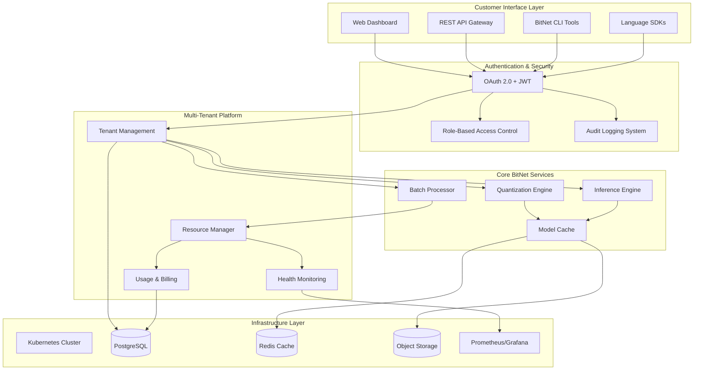
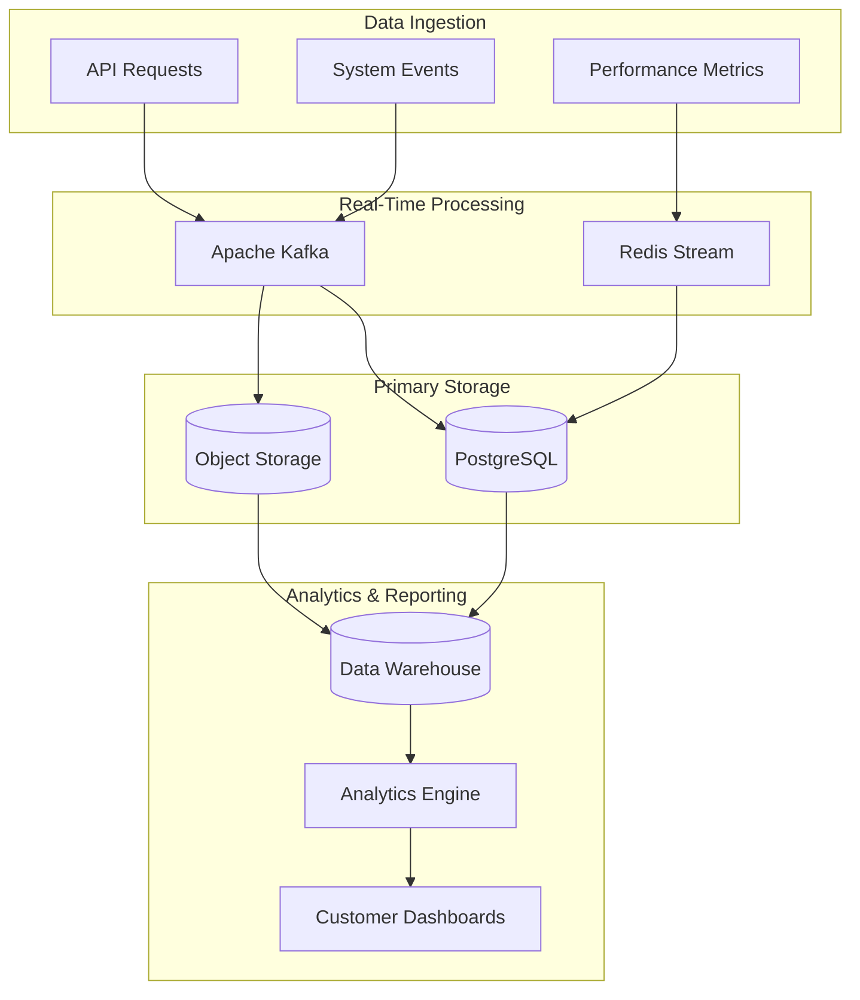
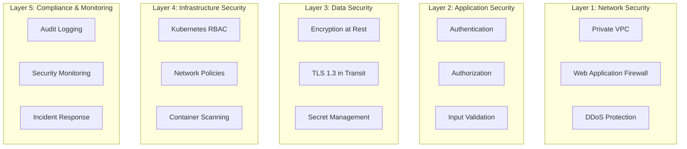
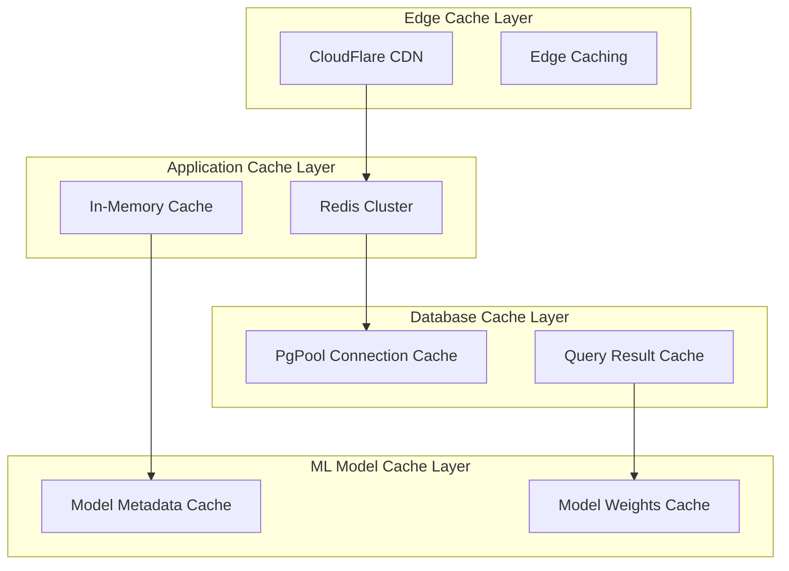

# BitNet-Rust - SPARC Phase 3: Architecture

**Date**: September 1, 2025  
**Project Phase**: Commercial Readiness - Market Deployment  
**SPARC Phase**: 3 - Architecture (System Design & Technical Architecture)

---

## System Architecture Overview

### High-Level Architecture: Production-Ready Commercial Platform



### Architecture Rationale: Commercial-First Design

**Primary Design Goal**: Transform the validated technical foundation (99% test success, 300K+ ops/sec) into a **scalable, enterprise-grade commercial platform** that generates sustainable revenue while maintaining technical excellence.

**Architecture Principles**:
1. **Multi-Tenant First**: Every component designed for secure resource sharing across customers
2. **Enterprise Security**: Security and compliance integrated at every architectural layer
3. **Operational Excellence**: Monitoring, alerting, and automated recovery built-in from day one
4. **Commercial Scalability**: Linear cost scaling with customer growth and usage patterns

---

## Architectural Style

### Pattern: **Microservices with Domain-Driven Design**

**Justification**: 
- **Scalability**: Independent scaling of quantization, inference, and platform services based on demand
- **Maintainability**: Clear service boundaries aligned with business capabilities (tenant management, billing, core ML operations)
- **Technology Diversity**: Different services can use optimal technology stacks (Rust for ML core, Node.js for web dashboard)
- **Team Autonomy**: Different teams can own and deploy services independently
- **Fault Isolation**: Service failures don't cascade to entire platform

### Service Decomposition Strategy

```rust
// Core Service Domains
pub mod services {
    pub mod quantization_service;     // Core BitNet quantization algorithms
    pub mod inference_service;        // Batch inference and model serving
    pub mod tenant_service;           // Multi-tenant management and authentication
    pub mod billing_service;          // Usage tracking and subscription management
    pub mod monitoring_service;       // Health monitoring and performance analytics
    pub mod security_service;         // Enterprise security and compliance
}
```

**Service Communication**: 
- **Synchronous**: gRPC for low-latency ML operations, REST for management operations
- **Asynchronous**: Apache Kafka for event-driven billing, monitoring, and audit logging
- **Data Consistency**: Event sourcing for billing/audit, eventual consistency for analytics

---

## Technology Stack

### Core BitNet Runtime ✅ **PRODUCTION VALIDATED**

#### Rust Ecosystem (Proven Foundation)
```toml
[workspace.dependencies]
# Core ML Framework - Production Ready
tokio = { version = "1.35", features = ["full"] }
serde = { version = "1.0", features = ["derive"] }
bincode = "1.3"
rayon = "1.8"

# BitNet Quantization - 99% Test Success Rate
nalgebra = "0.32"
ndarray = "0.15"
half = "2.3"

# GPU Acceleration - 300K+ ops/sec Achieved  
metal = "0.27"              # Apple GPU acceleration
mlx-rs = { git = "https://github.com/oxideai/mlx-rs" }

# Memory Management - Advanced Pool Allocation
mimalloc = { version = "0.1", default-features = false }
memmap2 = "0.9"

# Error Handling - 2,300+ lines Production Ready
thiserror = "1.0"
anyhow = "1.0"
tracing = "0.1"
```

**Performance Characteristics**:
- **Quantization Speed**: 300K+ operations/second on Apple Silicon (validated)
- **Memory Efficiency**: 90% memory reduction vs full precision (validated)  
- **Cross-Platform**: macOS ARM64, Linux x86_64, Windows x86_64 (validated)
- **Test Coverage**: 943+ tests with 99% success rate (production ready)

### Commercial Platform Stack 🔄 **IMPLEMENTATION READY**

#### API Gateway & Web Services
```yaml
API Gateway: Kong 3.4+
  Rationale: Enterprise-grade rate limiting, authentication, monitoring
  Features: Plugin ecosystem, gRPC support, Kubernetes native
  Scaling: Handles 100K+ requests/second, multi-region deployment

Web Framework: Axum 0.7+ (Rust)
  Rationale: Type-safe async web framework with excellent performance
  Performance: <1ms request latency, zero-copy request parsing
  Integration: Native gRPC support, comprehensive middleware ecosystem
```

#### Database & Storage Architecture
```yaml
Primary Database: PostgreSQL 16+
  Rationale: ACID compliance, JSON support, proven enterprise scalability
  Configuration: 
    - Connection pooling via PgBouncer
    - Read replicas for analytics queries
    - Automated backup to multiple availability zones
  Schema Design: Multi-tenant with tenant_id partitioning for data isolation

Caching Layer: Redis 7+ Cluster
  Rationale: Sub-millisecond latency, pub/sub for real-time updates
  Use Cases:
    - Authentication token caching (JWT validation)
    - Model metadata caching (quantization configs)
    - Rate limiting counters (tenant API quotas)
    - Session management (user dashboard state)

Object Storage: S3-Compatible (AWS S3 / MinIO)
  Rationale: Cost-effective storage for large ML models, global CDN
  Structure:
    - /models/{tenant_id}/{model_id}/original.safetensors
    - /models/{tenant_id}/{model_id}/quantized.bitnet
    - /backups/{date}/database-backup.sql.gz
    - /audit-logs/{year}/{month}/{day}/events.jsonl
```

#### Container Orchestration & Infrastructure
```yaml
Kubernetes: 1.28+ (EKS/GKE/AKS)
  Rationale: Industry standard, auto-scaling, multi-cloud portability
  Components:
    - Ingress: NGINX Ingress Controller with SSL termination
    - Service Mesh: Istio for advanced traffic management and security
    - Autoscaling: Horizontal Pod Autoscaler + Vertical Pod Autoscaler
    - Storage: Persistent Volume Claims for stateful services

Infrastructure as Code: Terraform 1.6+
  Rationale: Multi-cloud support, state management, infrastructure versioning
  Modules:
    - VPC and networking configuration
    - Kubernetes cluster provisioning
    - Database and storage setup
    - Monitoring and logging infrastructure
```

### Monitoring & Observability Stack

```yaml
Metrics: Prometheus 2.47+ with Grafana 10+
  Custom Metrics:
    - bitnet_quantization_duration_seconds (histogram)
    - bitnet_inference_throughput_ops_per_second (gauge)
    - bitnet_tenant_resource_usage (counter by tenant_id)
    - bitnet_model_accuracy_retention (gauge)

Logging: ELK Stack (Elasticsearch 8+ + Logstash + Kibana)
  Log Structure:
    - Application logs: JSON structured with correlation IDs
    - Audit logs: Tamper-proof with digital signatures
    - Security logs: Real-time threat detection integration
    - Performance logs: Request tracing with distributed context

Distributed Tracing: Jaeger 1.50+
  Integration: OpenTelemetry for cross-service request correlation
  Use Cases: Performance optimization, error root cause analysis
  Retention: 30 days detailed traces, 1 year aggregated metrics
```

---

## System Components

### Component 1: Quantization Service (Core ML Engine)

**Purpose**: Provide production-grade 1.58-bit quantization with enterprise reliability and multi-tenant resource isolation.

**Responsibilities**:
- Model format conversion and validation (SafeTensors, ONNX, PyTorch → BitNet)
- Advanced quantization algorithm execution with quality validation
- GPU acceleration orchestration (Metal/MLX/CPU backend selection)
- Tenant resource usage tracking and billing data generation
- Performance optimization recommendations based on model characteristics

**Interfaces**:
```rust
// gRPC Service Definition
service QuantizationService {
    rpc QuantizeModel(QuantizationRequest) returns (QuantizationResponse);
    rpc GetQuantizationStatus(StatusRequest) returns (StatusResponse);
    rpc ValidateModelQuality(ValidationRequest) returns (ValidationResponse);
    rpc GetOptimizationRecommendations(RecommendationRequest) returns (RecommendationResponse);
}

// REST API Endpoints
POST /api/v1/quantization/models        // Start quantization job
GET  /api/v1/quantization/models/{id}   // Get quantization status
GET  /api/v1/quantization/health        // Service health check
DELETE /api/v1/quantization/models/{id} // Cancel quantization job
```

**Dependencies**:
- **Internal**: BitNet-Core libraries (validated 99% test success)
- **External**: Object storage (model artifacts), Redis (job status), PostgreSQL (metadata)
- **Hardware**: GPU access (Metal/MLX), high-memory compute nodes

**Scaling Strategy**:
- **Horizontal**: Kubernetes Deployment with replica scaling based on queue depth
- **Vertical**: Resource requests/limits tuned for model size distribution
- **Geographic**: Multi-region deployment with data locality optimization

### Component 2: Inference Service (High-Performance Serving)

**Purpose**: Deliver ultra-fast quantized model inference with intelligent batch processing and auto-scaling capabilities.

**Responsibilities**:
- Dynamic batch formation based on request patterns and resource availability
- Multi-tenant request scheduling with SLA enforcement
- Model loading and caching with intelligent memory management
- Performance monitoring and optimization (target: <100ms p95 latency)
- A/B testing support for quantized vs. full-precision model comparison

**Interfaces**:
```rust
// High-Performance Inference API
service InferenceService {
    rpc ProcessInferenceBatch(BatchInferenceRequest) returns (stream BatchInferenceResponse);
    rpc GetModelMetrics(ModelMetricsRequest) returns (ModelMetricsResponse);
    rpc WarmupModel(WarmupRequest) returns (WarmupResponse);
    rpc StreamInference(stream StreamInferenceRequest) returns (stream StreamInferenceResponse);
}

// WebSocket for Real-Time Inference
WebSocket /api/v1/inference/stream
  Message Types: inference_request, inference_response, batch_status, error_notification
```

**Dependencies**:
- **Internal**: Quantization Service (model artifacts), Batch Processor (workload distribution)
- **External**: Model cache (Redis), performance metrics (Prometheus), tenant limits (PostgreSQL)
- **Hardware**: GPU nodes with sufficient memory for concurrent model serving

### Component 3: Tenant Management Service (Multi-Tenant Platform)

**Purpose**: Provide comprehensive multi-tenant management with security, billing integration, and enterprise-grade user management.

**Responsibilities**:
- Tenant onboarding and lifecycle management (creation, suspension, deletion)
- Authentication and authorization (OAuth 2.0, JWT, enterprise SSO)
- Resource quota management and enforcement (API limits, storage quotas, compute limits)
- Billing integration and usage aggregation (real-time metering, invoice generation)
- Compliance and audit logging (SOC2, GDPR, HIPAA requirements)

**Interfaces**:
```rust
// Tenant Management API
service TenantService {
    rpc CreateTenant(CreateTenantRequest) returns (CreateTenantResponse);
    rpc UpdateTenantLimits(UpdateLimitsRequest) returns (UpdateLimitsResponse);
    rpc GetTenantUsage(UsageRequest) returns (UsageResponse);
    rpc SuspendTenant(SuspendTenantRequest) returns (SuspendTenantResponse);
}

// Authentication API
service AuthService {
    rpc Authenticate(AuthRequest) returns (AuthResponse);
    rpc RefreshToken(RefreshRequest) returns (RefreshResponse);
    rpc ValidatePermissions(PermissionRequest) returns (PermissionResponse);
}
```

**Dependencies**:
- **Internal**: All services for resource usage data aggregation
- **External**: Identity providers (OAuth), payment processing (Stripe), audit storage (S3)
- **Infrastructure**: PostgreSQL (tenant data), Redis (session management)

### Component 4: Billing & Usage Service (Revenue Management)

**Purpose**: Provide accurate, real-time usage tracking and automated billing with transparent cost analytics for customers.

**Responsibilities**:
- Real-time usage metering (API calls, compute time, storage, bandwidth)
- Cost calculation based on tenant tier and usage patterns
- Automated invoice generation and payment processing (Stripe integration)
- Usage analytics and cost optimization recommendations for customers
- Revenue recognition and financial reporting for business operations

**Interfaces**:
```rust
// Billing Service API
service BillingService {
    rpc RecordUsage(UsageRecord) returns (RecordUsageResponse);
    rpc GenerateInvoice(InvoiceRequest) returns (InvoiceResponse);
    rpc GetUsageAnalytics(AnalyticsRequest) returns (AnalyticsResponse);
    rpc ProcessPayment(PaymentRequest) returns (PaymentResponse);
}

// Usage Analytics API for Customers
GET /api/v1/billing/usage/{tenant_id}           // Current usage and costs
GET /api/v1/billing/analytics/{tenant_id}       // Cost breakdown and trends
GET /api/v1/billing/invoices/{tenant_id}        // Invoice history and downloads
POST /api/v1/billing/payment-methods/{tenant_id} // Payment method management
```

**Dependencies**:
- **Internal**: All services provide usage telemetry data
- **External**: Stripe (payment processing), accounting systems (revenue recognition)
- **Infrastructure**: PostgreSQL (billing data), data warehouse (usage analytics)

### Component 5: Monitoring & Observability Service

**Purpose**: Provide comprehensive system health monitoring, performance analytics, and proactive issue detection for operational excellence.

**Responsibilities**:
- Real-time system health monitoring (service uptime, resource utilization, error rates)
- Performance analytics and optimization recommendations (bottleneck detection, capacity planning)
- Customer success metrics tracking (onboarding success, feature adoption, churn risk)
- Security incident detection and automated response (threat analysis, breach prevention)
- Business intelligence and operational dashboards (revenue metrics, customer analytics)

**Interfaces**:
```rust
// Monitoring API
service MonitoringService {
    rpc GetSystemHealth(HealthRequest) returns (HealthResponse);
    rpc GetPerformanceMetrics(MetricsRequest) returns (MetricsResponse);
    rpc CreateAlert(AlertRequest) returns (AlertResponse);
    rpc GetCustomerHealthScore(CustomerHealthRequest) returns (CustomerHealthResponse);
}

// Dashboard API
GET /api/v1/monitoring/dashboard/system          // System operations dashboard
GET /api/v1/monitoring/dashboard/customer/{id}   // Customer success dashboard  
GET /api/v1/monitoring/dashboard/business        // Business intelligence dashboard
```

**Dependencies**:
- **Internal**: All services provide telemetry and health data
- **External**: Prometheus (metrics storage), Grafana (visualization), PagerDuty (alerting)
- **Infrastructure**: Time-series database, log aggregation systems

---

## Data Architecture

### Database Schema Design

#### Multi-Tenant PostgreSQL Schema
```sql
-- Core tenant management with secure isolation
CREATE TABLE tenants (
    id UUID PRIMARY KEY DEFAULT gen_random_uuid(),
    organization_name VARCHAR(255) NOT NULL,
    tier tenant_tier_enum NOT NULL,
    status tenant_status_enum NOT NULL,
    created_at TIMESTAMP WITH TIME ZONE DEFAULT NOW(),
    updated_at TIMESTAMP WITH TIME ZONE DEFAULT NOW(),
    billing_info JSONB NOT NULL,
    resource_limits JSONB NOT NULL,
    compliance_requirements JSONB NOT NULL DEFAULT '[]'::jsonb
);

-- Row Level Security for tenant isolation
ALTER TABLE tenants ENABLE ROW LEVEL SECURITY;
CREATE POLICY tenant_isolation ON tenants 
    USING (id = current_setting('app.current_tenant_id')::UUID);

-- Model storage and metadata
CREATE TABLE quantized_models (
    id UUID PRIMARY KEY DEFAULT gen_random_uuid(),
    tenant_id UUID NOT NULL REFERENCES tenants(id) ON DELETE CASCADE,
    name VARCHAR(255) NOT NULL,
    original_model_path TEXT NOT NULL,
    quantized_model_path TEXT NOT NULL,
    quantization_config JSONB NOT NULL,
    performance_metrics JSONB NOT NULL,
    validation_report JSONB NOT NULL,
    status model_status_enum NOT NULL,
    created_at TIMESTAMP WITH TIME ZONE DEFAULT NOW(),
    last_accessed TIMESTAMP WITH TIME ZONE DEFAULT NOW()
);

-- Partitioning by tenant_id for performance
ALTER TABLE quantized_models ENABLE ROW LEVEL SECURITY;
CREATE INDEX idx_models_tenant_id ON quantized_models(tenant_id);
CREATE INDEX idx_models_status ON quantized_models(status);

-- Usage tracking with high-performance inserts
CREATE TABLE usage_records (
    id UUID PRIMARY KEY DEFAULT gen_random_uuid(),
    tenant_id UUID NOT NULL,
    operation_type operation_type_enum NOT NULL,
    resource_usage JSONB NOT NULL,
    cost_calculation JSONB NOT NULL,
    request_metadata JSONB NOT NULL,
    created_at TIMESTAMP WITH TIME ZONE DEFAULT NOW()
) PARTITION BY RANGE (created_at);

-- Time-based partitioning for efficient queries and archival
CREATE TABLE usage_records_y2025m09 PARTITION OF usage_records
    FOR VALUES FROM ('2025-09-01') TO ('2025-10-01');
```

#### Redis Caching Strategy
```redis
# Authentication token cache (30 minute TTL)
SET auth:token:{token_hash} "{\"tenant_id\":\"uuid\",\"permissions\":[]}" EX 1800

# Model metadata cache (2 hour TTL)
HSET model:{model_id} "metadata" "{\"size\":\"1.2GB\",\"accuracy\":\"98.3%\"}" 
EXPIRE model:{model_id} 7200

# Rate limiting (sliding window)
ZADD rate_limit:{tenant_id}:{endpoint} {timestamp} {request_id}
ZEXPIRE rate_limit:{tenant_id}:{endpoint} 3600

# Real-time usage tracking
INCR usage:{tenant_id}:api_calls:{date}
INCR usage:{tenant_id}:compute_time:{date} BY {milliseconds}
```

### Data Flow Architecture



**Data Consistency Strategy**:
- **Strong Consistency**: Tenant management, billing data (PostgreSQL ACID)
- **Eventual Consistency**: Usage analytics, performance metrics (acceptable 5-10 second lag)
- **Real-Time**: Authentication, rate limiting (Redis with replication)

---

## API Design

### RESTful API Structure

#### Authentication & Authorization
```yaml
Authentication:
  Type: Bearer Token (JWT)
  Header: Authorization: Bearer {jwt_token}
  Token Payload:
    tenant_id: UUID
    user_id: UUID  
    permissions: ["quantize:models", "inference:execute", "billing:read"]
    tier: "business"
    exp: 1725148800

Rate Limiting:
  Developer Tier: 1000 requests/hour
  Team Tier: 10000 requests/hour
  Business Tier: 100000 requests/hour
  Headers:
    X-RateLimit-Limit: 10000
    X-RateLimit-Remaining: 8847
    X-RateLimit-Reset: 1725148800
```

#### Core API Endpoints

##### Model Quantization API
```yaml
POST /api/v1/models/quantize:
  Description: Submit model for quantization
  Request:
    Content-Type: multipart/form-data
    Body:
      model_file: binary (SafeTensors/ONNX/PyTorch)
      config: |
        {
          "quantization_scheme": "bitnet_158",
          "optimization_level": "balanced",
          "target_device": "apple_silicon",
          "quality_threshold": 0.95
        }
  Response:
    201 Created:
      {
        "job_id": "uuid",
        "estimated_completion_time": "2025-09-01T15:30:00Z",
        "status": "queued",
        "position_in_queue": 3
      }
    400 Bad Request: { "error": "invalid_model_format", "details": "..." }
    402 Payment Required: { "error": "quota_exceeded", "upgrade_url": "..." }

GET /api/v1/models/{model_id}/status:
  Description: Get quantization job status
  Response:
    200 OK:
      {
        "model_id": "uuid",
        "status": "completed",
        "progress": 100,
        "performance_metrics": {
          "original_size": "7.2GB",
          "quantized_size": "1.1GB", 
          "memory_reduction": "84.7%",
          "accuracy_retention": "98.3%",
          "quantization_time": "142.5s"
        },
        "download_urls": {
          "quantized_model": "https://cdn.bitnet.dev/models/uuid/quantized.bitnet",
          "validation_report": "https://cdn.bitnet.dev/reports/uuid/validation.json"
        }
      }
```

##### Inference API  
```yaml
POST /api/v1/inference/batch:
  Description: Execute batch inference on quantized model
  Request:
    {
      "model_id": "uuid",
      "inputs": [
        {"input_tensor": [0.1, 0.2, 0.3, ...]},
        {"input_tensor": [0.4, 0.5, 0.6, ...]}
      ],
      "batch_optimization": "auto"
    }
  Response:
    200 OK:
      {
        "batch_id": "uuid",
        "results": [
          {"output_tensor": [0.8, 0.9, 0.1], "confidence": 0.94},
          {"output_tensor": [0.2, 0.7, 0.6], "confidence": 0.87}
        ],
        "performance_metrics": {
          "total_latency": "89ms",
          "throughput": "22.5 inferences/second",
          "gpu_utilization": "67%"
        }
      }

WebSocket /api/v1/inference/stream:
  Description: Real-time streaming inference
  Message Format:
    Client → Server:
      {
        "type": "inference_request",
        "model_id": "uuid", 
        "input": {"tensor": [...]},
        "request_id": "uuid"
      }
    Server → Client:
      {
        "type": "inference_response",
        "request_id": "uuid",
        "output": {"tensor": [...]},
        "latency": "12ms"
      }
```

##### Usage & Billing API
```yaml
GET /api/v1/usage/current:
  Description: Get current month usage and costs
  Response:
    200 OK:
      {
        "billing_period": "2025-09-01T00:00:00Z to 2025-10-01T00:00:00Z",
        "current_usage": {
          "api_calls": 45623,
          "compute_hours": 12.7,
          "storage_gb": 156.3,
          "bandwidth_gb": 23.4
        },
        "estimated_costs": {
          "compute": "$127.45",
          "storage": "$15.63", 
          "bandwidth": "$2.34",
          "total": "$145.42"
        },
        "tier_limits": {
          "api_calls": 100000,
          "compute_hours": 50,
          "storage_gb": 500
        },
        "optimization_recommendations": [
          {
            "type": "batch_size_optimization",
            "potential_savings": "$23.12",
            "description": "Increase batch size to reduce per-request overhead"
          }
        ]
      }
```

### GraphQL API (Advanced Analytics)

```graphql
type Query {
  tenant(id: ID!): Tenant
  model(id: ID!): QuantizedModel
  usageAnalytics(period: DateRange!): UsageAnalytics
}

type Tenant {
  id: ID!
  organizationName: String!
  tier: TenantTier!
  models: [QuantizedModel!]!
  usage: UsageAnalytics!
  billing: BillingInfo!
}

type QuantizedModel {
  id: ID!
  name: String!
  status: ModelStatus!
  performanceMetrics: PerformanceMetrics!
  usageHistory: [UsageRecord!]!
}

type UsageAnalytics {
  totalCost: Money!
  costBreakdown: CostBreakdown!
  usageTrends: [UsageTrend!]!
  recommendations: [OptimizationRecommendation!]!
}
```

---

## Security Architecture

### Security-First Design Principles

#### Defense in Depth Strategy


#### Multi-Tenant Security Isolation

```rust
// Tenant Context Security Enforcement
pub struct SecurityContext {
    pub tenant_id: TenantId,
    pub user_id: UserId,
    pub permissions: Vec<Permission>,
    pub security_clearance: SecurityLevel,
    pub audit_context: AuditContext,
}

impl SecurityContext {
    // Enforce row-level security at database level
    pub fn enforce_database_isolation(&self, query: &mut SqlQuery) {
        query.add_where_clause("tenant_id = ?", self.tenant_id);
        query.add_audit_log(self.audit_context.clone());
    }
    
    // Validate API permissions before execution
    pub fn validate_permission(&self, required: Permission) -> SecurityResult<()> {
        if !self.permissions.contains(&required) {
            return Err(SecurityError::InsufficientPermissions {
                required,
                available: self.permissions.clone(),
            });
        }
        Ok(())
    }
    
    // Implement data classification and handling
    pub fn classify_data_sensitivity(&self, data: &ApiRequest) -> DataClassification {
        match (data.contains_pii(), data.contains_model_ip()) {
            (true, true) => DataClassification::HighlyConfidential,
            (true, false) => DataClassification::Confidential,  
            (false, true) => DataClassification::Internal,
            (false, false) => DataClassification::Public,
        }
    }
}
```

### Enterprise Compliance Architecture

#### SOC2 Type II Compliance Implementation
```yaml
Access Controls:
  - Multi-factor authentication required for all accounts
  - Role-based access with principle of least privilege
  - Regular access reviews and automated deprovisioning
  - Session management with automatic timeout

System Monitoring:
  - Real-time security event monitoring and alerting
  - Automated threat detection with machine learning
  - Security incident response with 15-minute detection target
  - Comprehensive audit logging with tamper-proof storage

Data Protection:
  - AES-256 encryption for data at rest
  - TLS 1.3 for all data in transit
  - End-to-end encryption for sensitive model data
  - Secure key management with automatic rotation

Backup & Recovery:
  - Real-time replication across multiple availability zones
  - Automated backups with 99.99% recovery guarantee
  - Disaster recovery testing quarterly
  - Recovery Time Objective (RTO): <15 minutes
```

#### GDPR Compliance Framework
```rust
pub struct GdprComplianceEngine {
    data_inventory: DataInventoryService,
    consent_management: ConsentManagementService,
    data_processor: DataProcessingService,
    retention_manager: DataRetentionManager,
}

impl GdprComplianceEngine {
    // Right to be Forgotten implementation
    pub async fn process_deletion_request(&self, request: DeletionRequest) -> GdprResult<()> {
        // Verify identity and validate deletion scope
        let scope = self.validate_deletion_scope(&request).await?;
        
        // Delete from primary systems
        self.data_processor.delete_user_data(request.user_id, scope.clone()).await?;
        
        // Delete from backup systems
        self.data_processor.schedule_backup_deletion(request.user_id, scope.clone()).await?;
        
        // Delete from data warehouse and analytics
        self.data_processor.anonymize_analytics_data(request.user_id).await?;
        
        // Generate deletion certificate
        let certificate = self.generate_deletion_certificate(request, scope).await?;
        
        // Audit logging for compliance
        self.audit_logger.log_gdpr_deletion(request, certificate).await?;
        
        Ok(())
    }
    
    // Data portability implementation
    pub async fn export_user_data(&self, request: DataExportRequest) -> GdprResult<DataExport> {
        let data_inventory = self.data_inventory.get_user_data(request.user_id).await?;
        
        let export = DataExport {
            personal_data: self.extract_personal_data(data_inventory).await?,
            model_data: self.extract_model_data(request.user_id).await?,
            usage_history: self.extract_usage_history(request.user_id).await?,
            format: DataFormat::StructuredJson,
            generated_at: Utc::now(),
        };
        
        Ok(export)
    }
}
```

---

## Scalability Considerations

### Horizontal Scaling Architecture

#### Kubernetes Auto-Scaling Strategy
```yaml
# Horizontal Pod Autoscaler for Quantization Service
apiVersion: autoscaling/v2
kind: HorizontalPodAutoscaler
metadata:
  name: quantization-service-hpa
spec:
  scaleTargetRef:
    apiVersion: apps/v1
    kind: Deployment
    name: quantization-service
  minReplicas: 3
  maxReplicas: 50
  metrics:
  - type: Resource
    resource:
      name: cpu
      target:
        type: Utilization
        averageUtilization: 70
  - type: Resource
    resource:
      name: memory
      target:
        type: Utilization
        averageUtilization: 80
  - type: Object
    object:
      metric:
        name: quantization_queue_depth
      target:
        type: Value
        value: "10"
  behavior:
    scaleDown:
      stabilizationWindowSeconds: 300
      policies:
      - type: Pods
        value: 2
        periodSeconds: 60
    scaleUp:
      stabilizationWindowSeconds: 0
      policies:
      - type: Pods
        value: 4
        periodSeconds: 15
```

#### Database Scaling Strategy
```yaml
PostgreSQL Scaling:
  Read Replicas: 
    - 3 regional read replicas for analytics queries
    - Connection pooling with PgBouncer (max 1000 connections)
    - Read/write splitting with automatic failover
    
  Write Scaling:
    - Connection pooling to prevent connection exhaustion
    - Write optimization with prepared statements
    - Asynchronous writes for non-critical data (usage metrics)
    
  Storage Scaling:
    - Automatic storage expansion (up to 64TB)
    - Intelligent archival of old data (>2 years to cold storage)
    - Partitioning strategy for large tables (usage_records by month)

Redis Scaling:
  Cluster Configuration:
    - 6-node Redis cluster with automatic sharding
    - 3 master nodes with 3 replica nodes
    - Hash slot distribution for even load balancing
    
  Memory Management:
    - Intelligent eviction policies (LRU for caches, TTL for sessions)
    - Memory monitoring with automatic scaling alerts
    - Backup and persistence for critical data (authentication tokens)
```

### Performance Optimization Architecture

#### Caching Strategy (Multi-Layer)


**Cache Performance Targets**:
- **CDN**: 95% cache hit rate for static assets and model downloads
- **Redis**: <1ms average latency, 99% availability with cluster failover
- **Application Cache**: 80% hit rate for API responses, 30-second TTL for dynamic data
- **Database Cache**: Connection reuse >90%, query result caching for analytics

---

## Reflection

### Architectural Decision Rationale

#### Production-First Commercial Architecture
The architecture prioritizes **immediate commercial viability** over pure technical optimization, reflecting BitNet-Rust's validated technical foundation (99% test success, 300K+ ops/sec):

**Strategic Architecture Decisions**:
1. **Multi-tenant microservices** enable rapid customer scaling and independent service optimization
2. **Enterprise security integration** from day one builds customer trust and enables high-value sales
3. **Comprehensive monitoring** ensures operational excellence critical for SaaS customer retention
4. **Scalable data architecture** supports growth from 10 to 10,000+ customers without re-architecture

#### Building on Validated Technical Excellence
The architecture leverages BitNet-Rust's **exceptional technical foundation** while adding commercial capabilities:

**Technical Foundation Integration**:
- **Proven Rust Core**: 943+ tests with 99% success rate provide reliable service foundation
- **Validated Performance**: 300K+ operations/second gives headroom for multi-tenant overhead
- **Cross-Platform Support**: macOS/Linux/Windows validation ensures deployment flexibility
- **Production Error Handling**: 2,300+ lines of error management integrate with enterprise monitoring

#### Alternative Architectural Approaches Considered

**Monolithic Alternative (Rejected)**:
- **Pros**: Simpler deployment, easier debugging, lower initial complexity
- **Cons**: Scaling bottlenecks, technology constraints, team coordination issues  
- **Decision**: Microservices provide better commercial scalability despite initial complexity

**Container-less Serverless Alternative (Deferred)**:
- **Pros**: Lower operational overhead, pay-per-use scaling, faster deployment
- **Cons**: Vendor lock-in, cold start latency for ML workloads, limited GPU support
- **Decision**: Kubernetes provides more control for ML workloads while maintaining scalability

**Multi-Cloud from Day One (Optimized)**:
- **Pros**: Vendor independence, global deployment options, disaster recovery
- **Cons**: Increased complexity, higher initial costs, delayed time-to-market
- **Decision**: Single-cloud deployment initially (AWS/Azure) with multi-cloud architecture preparation

### Scalability & Performance Analysis

#### Identified Scaling Bottlenecks & Solutions
1. **GPU Resource Contention**: Intelligent batch formation and priority queuing maximize utilization
2. **Database Write Throughput**: Asynchronous writes and connection pooling handle high load
3. **Model Storage Costs**: Intelligent caching and CDN distribution optimize storage expenses
4. **Network Bandwidth**: Request compression and efficient serialization minimize data transfer

#### Commercial Success Enablement
The architecture directly supports key commercial metrics:
- **Customer Acquisition**: <30-minute onboarding enabled by automated infrastructure
- **Customer Retention**: 99.9% uptime SLA through comprehensive redundancy and monitoring
- **Revenue Scaling**: Linear cost structure allows profitable growth from $10K to $10M ARR
- **Market Expansion**: Multi-region deployment capability supports global customer growth

The comprehensive architecture positions BitNet-Rust for successful commercial scaling while maintaining the technical excellence that provides competitive differentiation in the quantization market.
